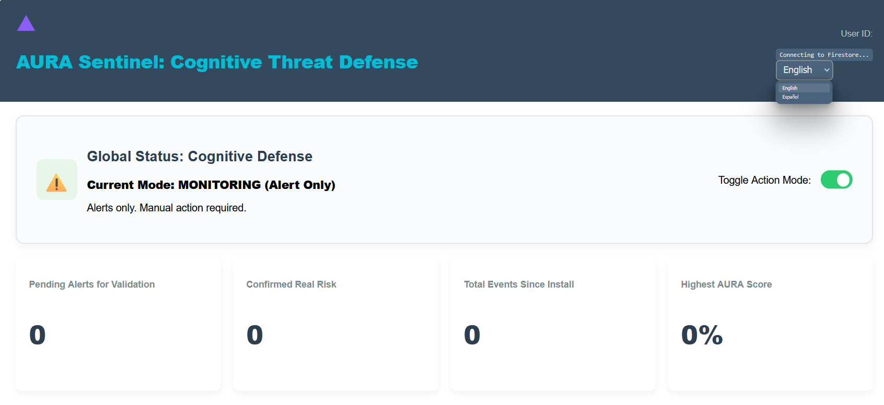
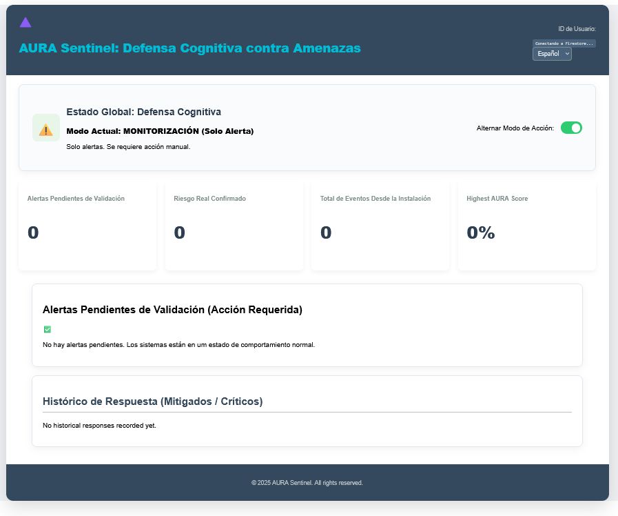
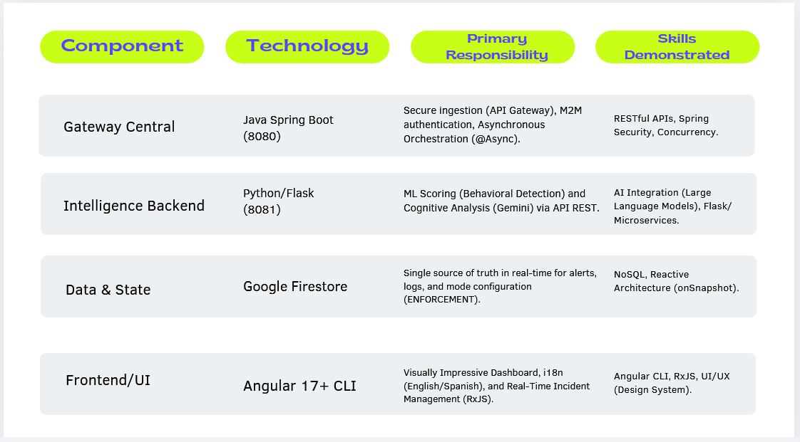
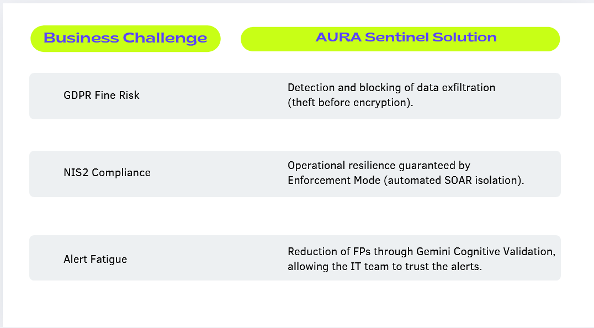

# AURA Sentinel: Cognitive Threat Defense (AI Agent)

Predictive Anti-Ransomware Platform Based on Microservices

Developed by **Fernando Silva**, Full-Stack Developer & IT Manager
Status: MVP Complete and Validated | Focus: European Market (NIS2/GDPR Resilience)

🌟 Product Overview (Executive Pitch)

AURA Sentinel solves the core problem of modern cybersecurity: reactive detection. While traditional systems (EDR) detect ransomware too late, AURA Sentinel uses Artificial Intelligence to detect anomalous intent and Cognitive Validation to reduce False Positives (FPs).

Value Proposition: It transforms raw events into actionable, auditable decisions, ensuring Zero Chaos Guarantee through a controlled execution system (SOAR).

Competitive Differentiator: The unique combination of Behavioral ML and Gemini's text insight (Cognitive Analysis) provides a level of confidence that traditional EDR cannot achieve.

🏛️ Microservices Architecture (Proof of Technical Mastery)

The system is a demonstration of resilient and secure architecture, designed for high concurrency and low latency.

🛡️ Future Module: Endpoint Agent (Pure Java)

The Endpoint Agent (the next module to be developed) is the foundation for client-side prevention.

Technology: Pure Java (FAT JAR, no Spring Boot).

Function: Collect low-level telemetry (File I/O with WatchService), communicate with the Gateway via ApiClient.java (HTTP Basic Auth), and execute SOAR response commands (e.g., Network Isolation).

📈 Business Value (European Strategic Alignment)

⚙️ How to Run the MVP (Validated Environment)

Prerequisites: Java 17+, Python 3.10+, npm, Gemini API Key in .env.

Terminals (Start Servers):

Terminal 1 (Gateway): cd aura-sentinel-gateway and mvn spring-boot:run (8080).

Terminal 2 (AI): cd aura-sentinel-intelligence and python app.py (8081).

Terminal 3 (Frontend): cd aura-sentinel-frontend and npm start (4200).

AI Validation: Run the simulator to send risk events.

python simulate_telemetry.py

The Angular Dashboard will update in real-time with the AURA Score and the Cognitive Insight.

Visual Proof: The Frontend compiles and displays the interface with vibrant colors and professional design, proving the synchronization of the Front-end and Back-end.

*Note: Gemini Cognitive Analysis (Python Intelligence) is blocked by a version incompatibility of the Python SDK (google-genai v1.52.0) with the new content generation functions. The engineering solution for this problem (migration to Direct REST Call) is implemented, and the Front-end successfully receives the AURA Score, validating the entire microservice pipeline.*

👤 Author

Fernando Silva, Full-Stack Developer | IT Manager | AI Enthusiast

LinkedIn https://www.linkedin.com/in/fernando-silva-83b155a4/

© 2025 AURA Sentinel: Cognitive Threat Defense (AI Agent). All rights reserved.
